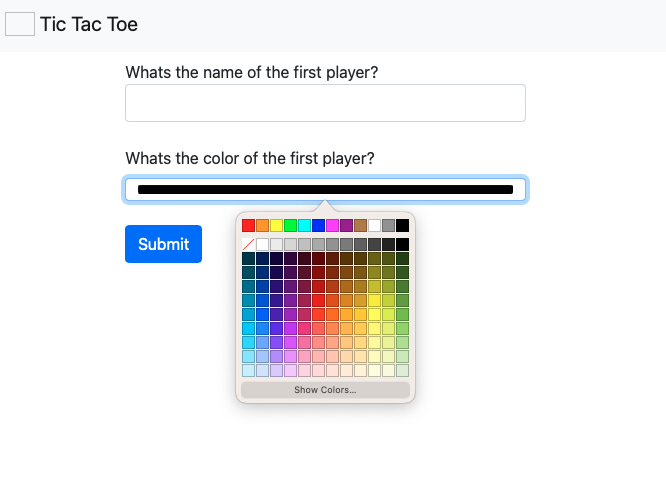

# tic-tac-toe

> This is a solution to the [Odin project lesson: Tic Tac Toe](https://www.theodinproject.com/lessons/node-path-javascript-tic-tac-toe).

## Built With

- JavaScript
- CSS
- HTML
- Bootstrap

## LIVE DEMO

- Open the [Live Demo](https://disc3110.github.io/tic-tac-toe/)

### Game description

Tic Tac Toe is a game that consists of two players and a 3x3 cell board, a symbol is assigned
to each player, or in this case, a color, it should be different for each player. The players will take turns to mark an empty cell, the first player to strike a three symbol straight line wins,
the line can be horizontal, vertical, or diagonal. If the board is full and there is no winner, then there is a tie.

### Game instructions

- To start the game, open the [Live Demo](https://disc3110.github.io/tic-tac-toe/) link
- Write your name and choose a color.
- Click on the submit button
- Write the name of the second player and choose a different color.
- Click on the submit button
  
- Click the cell you want to mark
- Repeat the last step until there is a winner or a tie
  
- The results score will load and you choose to play again if you want!
  

## Authors

👤 **Author**

- GitHub: [disc3110](https://github.com/disc3110)
- Twitter: [Diego Ivan Solis](https://twitter.com/disc3110)

## 🤝 Contributing

Contributions, issues, and feature requests are welcome!

Feel free to check the [issues page](https://github.com/disc3110/tic-tac-toe/issues).

## Show your support

Give a ⭐️ if you like this project!

## Acknowledgments

- Odin Project

## 📝 License

This project is [MIT](https://es.wikipedia.org/wiki/Licencia_MIT) licensed.
